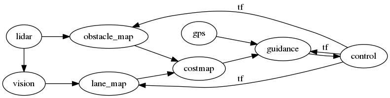

# Software Overview

This project is based on the Robotic Operating System (ROS).
Its name is somewhat misleading: ROS is really just a set of
useful packages for Robotics development.

Out of the box, ROS provides many features. We mainly utilize
[Topics](http://wiki.ros.org/Topics) for inter-process communication
and [RViz](http://wiki.ros.org/rviz/) for debugging.

## Structure

All of the code can be found in the `src/navigation_launch` folder.
Currently, most of the code is written in Python 2 (3 is not supported
as of ROS Lunar). We are trying to move to C++ for CPU-intensive parts
of the code, as we ran into some performance issues during the 2019
competition.

Functionality is broken out into "nodes", which each have more-or-less 
one responsibility. These nodes communicate with each other using topics.

### Primary ROS Nodes

The following shows the 2019 node graph:

**lidar**

The lidar node grabs data from the RPLidar A3 and transforms it to a 
list of vectors.

**vision**

The vision node is responsible for grabbing frames from the camera and
applying OpenCV filters to extract line positions. It uses the lidar to
mask out while barrels (false positive).

**obstacle_map/lane_map**

Tracks historical obstacle/lane data in a 100x100 image. Black pixels (0)
represent free locations and white pixels (255) represent occupied locations.
Values range from 0-255 depending on certainty. The BreezySLAM library is used 
to build these maps.

**costmap**

The costmap overlays the lane and obstacle maps. It also dilates the obstacles
to fill in gaps. This data is passed to Guidance to perform path planning.

**guidance**

Contains high level navigation logic. Uses a state machine to track which
mode the robot is in (lane following or GPS waypoint following).

**control**

Writes output to wheels. Also reads rotational data and publishes it on the
`tf` (transform) topic.
